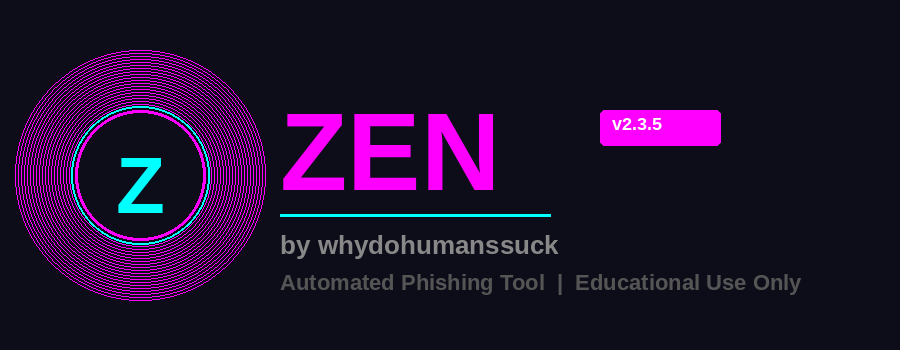

<p align="center">
  
</p>

<h1 align="center">
  <b>ZEN</b>
</h1>

<p align="center">
  <b>Redesigned phishing toolkit for educational purposes.</b><br>
  <sub>Based on <a href="https://github.com/htr-tech/zphisher">htr-tech/zphisher</a> — reimagined with new UI, colors, and branding.</sub>
</p>

<p align="center">
  
  
  
  
</p>

<p align="center">
  
  
  
  
  
  
  
  
  
</p>

---

## Features

- **30+ Phishing Templates** — Facebook, Instagram, Google, Netflix, Steam, Discord, and more
- **Multiple Tunnel Options** — Cloudflared, LocalXpose, and Localhost
- **Custom Port Support** — Run on any port you want
- **Auto Dependency Installer** — Sets up PHP, Curl, Unzip automatically
- **Termux Compatible** — Works out of the box on Android via Termux
- **Custom URL Masking** — Disguise phishing links with any URL

## Installation

### Termux

```bash
pkg update && pkg upgrade
pkg install git php curl unzip
git clone https://github.com/whydohumanssuck/zen.git
cd zen
chmod +x zen.sh
./zen.sh
```

### Linux (Debian/Ubuntu)

```bash
sudo apt update && sudo apt upgrade
sudo apt install git php curl unzip
git clone https://github.com/whydohumanssuck/zen.git
cd zen
chmod +x zen.sh
./zen.sh
```

## Docker

```bash
git clone https://github.com/whydohumanssuck/zen.git
cd zen
sudo docker build -t zen .
sudo docker run -it zen
```

## Supported Templates

| Platform | Variants |
|----------|----------|
| Facebook | Login, Advanced, Security, Messenger |
| Instagram | Login, Followers |
| Google | Login, Voting |
| Microsoft | Login |
| Netflix | Login |
| PayPal | Login |
| Steam | Login |
| Twitter | Login |
| TikTok | Login |
| Discord | Login |
| + 20 more | See `main_menu` in script |

## How It Works

1. Select a target platform from the menu
2. Choose a tunneling method (Cloudflared recommended)
3. A phishing link is generated and served
4. When the target visits the link and enters credentials, they are captured
5. Credentials are saved to `.servers/` directory

## Disclaimer

> **Zen** is made for **educational purposes only**. The author is not responsible for any misuse. Only use this on systems you own or have explicit permission to test. Unauthorized use is illegal.

## Credits

- **Original Project** — [htr-tech/zphisher](https://github.com/htr-tech/zphisher)
- **Redesigned By** — [whydohumanssuck](https://github.com/whydohumanssuck)
- **Template Contributors** — 1RaY-1, Adi1090x, AliMilani, BDhackers009, KasRoudra, E343IO, sepp0, ThelinuxChoice, Yisus7u7

## License

This project is licensed under the **GPL v3** — see the [LICENSE](LICENSE) file for details.

---

<p align="center">
  
  
</p>
